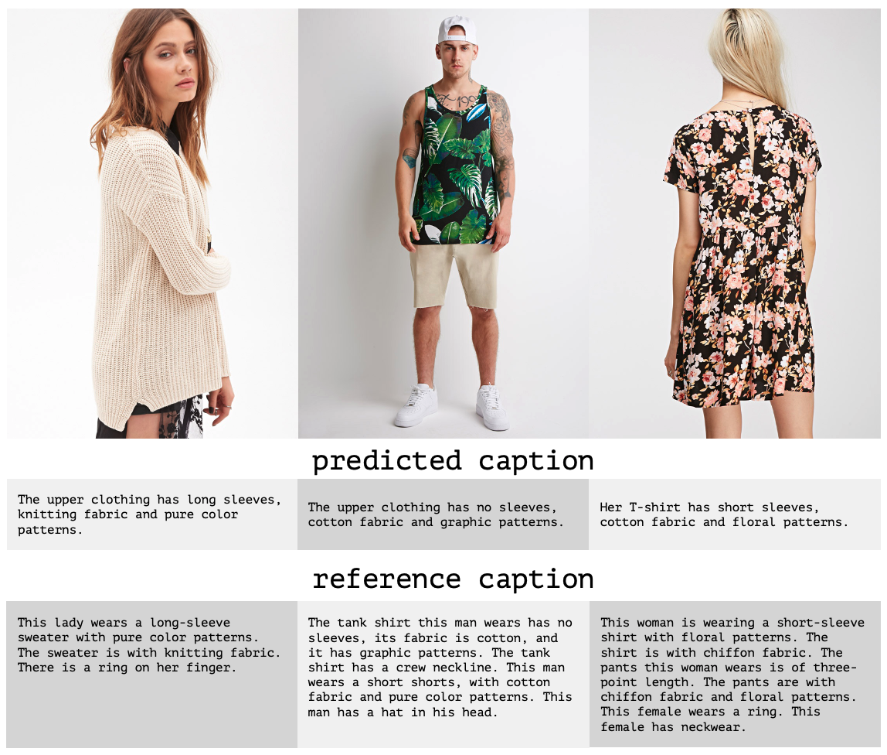
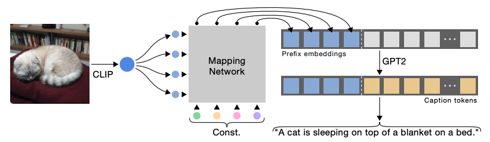
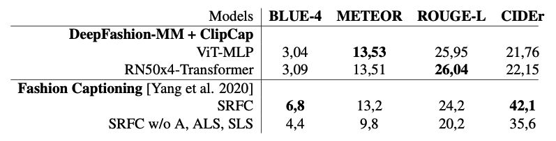

# ClipFashion: Using ClipCap for Image Captioning applied to DeepFashion-MultiModal



## Table of contents
  * [Description](#description)
  * [DeepFashion-MultiModal](#deepfashion-multimodal)
  * [ClipCap Architecture](#clipcap-architecture)
  * [Metrics Evaluation](#metrics-evaluation)
  * [Code Reproduction](#code-reproduction)
    + [Setup Conda and Data Download](#setup-conda-and-data-download)
      - [Configure Conda Environment](#configure-conda-environment)
      - [Download DeepFashion-MultiModal](#download-deepfashion-multimodal)
    + [Parsing Data](#parsing-data)
    + [Training](#training)
      - [Checkpoints](#checkpoints)
      - [MLflow](#mlflow)
    + [Prediction](#prediction)
    + [Evaluation](#evaluation)
      - [nlg-eval installation](#nlg-eval-installation)

## Description 
Creating meaningful descriptions for fashion images can improve product online searches, drive price strategies towards similar items sold by competitors, and have an impact on overall sales. In this work, we tackled the task of image captioning by implementing two variations of **ClipCap** ([link to repo](https://github.com/rmokady/CLIP_prefix_caption)) multimodal architecture, using the images and caption data from **DeepFashion-MultiModal** ([link to repo](https://github.com/yumingj/DeepFashion-MultiModal)). 


## DeepFashion-MultiModal
For our data, we used the DeepFashion-MultiModal dataset, a large-scale high-quality human dataset with rich multi-modal annotations. It contains 44,096 images with textual description for each image (as well as human parsing, densepose, key points and labels). 

We divided the dataset in train set (36,162), validation set (3,191) and test set (3,191). Those splits were made using a stratified sampling strategy to correctly represent each department and group of fashion items present in the data. 

## ClipCap Architecture
ClipCap uses [CLIP](https://github.com/openai/CLIP) embeddings as a prefix to the textual captions using a mapping network. A GPT-2 language is then fine-tuned to generate captions for the images. We tested two variations of ClipCap: one using CLIP's ViT embeddings and training both for the mapping network and fine-tuning a GPT-2 language model; and one that uses CLIP's RN50x4 embeddings and trains only the mapping network.


## Metrics Evaluation
We evaluated our models against similar works as [Fashion Captioning: Towards Generating Accurate Descriptions with Semantic Rewards](https://github.com/xuewyang/Fashion_Captioning) from Yang et al. (2020). Despite using a quite simple approach to fashion captioning, our results are better than those reported in Yang et al. when considering metrics METEOR and ROUGE-L, and worse regarding BLUE-4 and CIDE-r metrics.


## Code Reproduction
In this section, we have all the steps necessary to reproduce our results considering the two variations of ClipCap implementation we used: 1) **ViT** embeddings + training both mapping network and GPT-2; 2) **RN50x4** embeddings + training only the mapping network.

### Setup Conda and Data Download
#### Configure Conda Environment
```bash
$ conda env create -f environment.yml   # create conda environment
$ conda activate clipcap                # activate environment
```

#### Download DeepFashion-MultiModal
```bash
$ chmod +x deepfashion-mm.sh    # make script executable 
$ . ./deepfashion-mm.sh         # execute script to download files
```

### Parsing Data
Data downloaded in the step above is parsed to an image encoder that uses a CLIP model to generate the visual embeddings and applies the stratification strategy to form our train, validation and test splits. Each data split is saved as a pickle file.

#### ViT
```bash
$ python parse_data.py --clip_model_type ViT-B/32 
```
#### RN50x4
```bash
$ python parse_data.py --clip_model_type RN50x4 
```

### Training
Our training loops follow ClipCap implementation and parameter values described in their repo. 
#### ViT
```bash
$ python train.py \
    --train_data ./deepfashion-mm/deepfashion_ViT-B_32_train.pkl \
    --val_data ./deepfashion-mm/deepfashion_ViT-B_32_val.pkl \
    --mapping_type transformer  \
    --epochs 10 \
    --num_layers 8 \
    --prefix_length 40 \
    --prefix_length_clip 40
```

#### RN50x4
```bash
$ python train.py \
    --train_data ./deepfashion-mm/deepfashion_RN50x4_train.pkl \
    --val_data ./deepfashion-mm/deepfashion_RN50x4_val.pkl \
    --only_prefix \
    --mapping_type transformer \
    --epochs 10 \
    --num_layers 8 \
    --prefix_length 40 \
    --prefix_length_clip 40 \
    --is_rn
```
#### Checkpoints
During training, for each epoch we save a pytorch model checkpoint inside the `checkpoints/` folder.

#### MLflow
We used MLflow to control our experiments and compare results. Experiments are saved locally inside the `mlruns/` folder, and can be accessed running the MLflow UI local server (`mlflow ui`) in the repo's root folder.

### Prediction
To generate predictions, set the `--model_path` argument to reflect the desired trained model saved on `checkpoints/` folder. A jupyter notebook is available on `notebooks/` folder to compare generated predictions against the textual description from DeepFashion-MM dataset.

#### ViT
```bash
$ python predict.py \
    --model_name ViT_MLP_both \
    --clip_model_type ViT-B/32 \
    --data_path ./deepfashion-mm/data_splits_ViT-B_32.json \
    --prefix_length 40 \
    --use_beam_search \
    --model_path ./checkpoints/clipcap_20220611_213502/deepfashion_clipcap-009.pt
```

#### RN50x4
```bash
$ python predict.py \
    --model_name RN50x4_Transf_prefix \
    --clip_model_type RN50x4 \
    --data_path ./deepfashion-mm/data_splits_RN50x4.json \
    --prefix_length 40 \
    --use_beam_search \
    --only_prefix \
    --model_path ./checkpoints/clipcap_20220613_100654/deepfashion_clipcap-009.pt
```

### Evaluation
#### nlg-eval installation
To compute the evaluation metrics you need `nlg-eval` installed. Refer to the [installation and setup instructions](https://github.com/Maluuba/nlg-eval#setup) in their repo.

#### ViT
```bash
$ python evaluate.py \
    --cap_path ./deepfashion-mm/captions.json \
    --pred_path output/pred_captions_ViT_MLP_both.json
```

#### RN50x4
```bash
$ python evaluate.py \
    --cap_path ./deepfashion-mm/captions.json \
    --pred_path output/pred_captions_RN50x4_Transf_prefix.json
```
